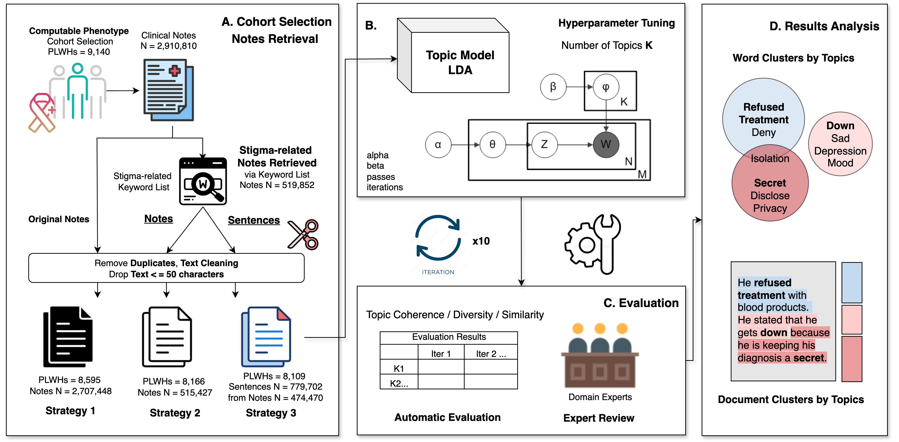

# 📖 Topic Modeling of HIV Stigma Dimensions, Social, and Related Behavioral Circumstances

This project applies natural language processing (NLP) and topic modeling to electronic health record (EHR) clinical notes to uncover how HIV stigma and related social and behavioral circumstances are expressed among people living with HIV (PLWHs). Using Latent Dirichlet Allocation (LDA), expert-curated keyword lists, and demographic subgroup analysis, the study characterizes the topics of stigma, offering new insights into the patterns within clinical documentation.




## ⚡ Intro
- Text Preprocessing:
  Stopword removal, punctuation filtering, and lemmatization
- Topic Modeling: `Latent Dirichlet Allocation (LDA)` [Gensim](https://radimrehurek.com/gensim/models/ldamodel.html) 
- Evaluation Metrics: `Coherence Score`, `Average Jaccard Similarity`, `Topic Diversity`
- Automated Analysis: Iterate over multiple `numbers of topics` and `iterations` to identify optimal model parameters
- Result Export: Outputs metrics for all experiments into a CSV file for downstream analysis

## 🚀 Usage

1. Prepare your dataset as a CSV file with a column note_text from clinical notes.
2. Run the LDA pipeline:
```shell script
python lda_hiv_stigma.py
```
3. The script will output:
output.csv containing iteration, number of topics, coherence score, Jaccard similarity, and topic diversity
Printed topics for each iteration and topic number

## 📚 Citation
Please cite our paper: https://arxiv.org/abs/2506.09279
```
@article{chen2025topic,
  title={A Topic Modeling Analysis of Stigma Dimensions, Social, and Related Behavioral Circumstances in Clinical Notes Among Patients with HIV},
  author={Chen, Ziyi and Liu, Yiyang and Prosperi, Mattia and Vaddiparti, Krishna and Cook, Robert L and Bian, Jiang and Guo, Yi and Wu, Yonghui},
  journal={arXiv preprint arXiv:2506.09279},
  year={2025}
}
```

## Contact
Please contact us or post an issue if you have any questions.
* Ziyi Chen (chenziyi@ufl.edu)
* Yonghui Wu (yonghui.wu@ufl.edu)
